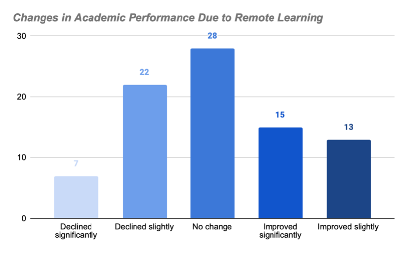

# The Impact of Remote Learning on Student Performance
#### Group Home Assignment – Research Survey

**Module Code:** SKIB408

**Module Title:** Skills for Data Analysts

**Module Leader:** Gergely Tamasi

**Academic Year:** 2024  

**Students:** Federico Merino Barrera, Shreyas Satish Sawant, Mohamed Tabka, Adam Khan

**Wordcount:** 2,763

**Date of submission:** 05/12/2024

---

# Introduction 

## Context  
In recent years, the world has become increasingly digitalized, but it was in 2020 that one of the biggest societal shifts took place due to the Covid-19 pandemic. Almost overnight, the world had to adapt to a fully digital environment, including the educational system. Daily routines of attending school or university, socializing with classmates and teachers, were replaced by hours spent at home in front of a screen, listening to lectures. Today, remote education has become a normal part of many institutions, but the rapid shift left little time for analysis or preparation to transition from a physical to a digital learning mode.

Coursera, a company specializing in digital education, published an impact report in 2021 highlighting this dramatic shift. According to the report, the number of registered learners on their platform increased by 61% from 2019 to 2020. Additionally, course enrollments rose from 76 million in 2019 to 143 million in 2020, an impressive 88% increase in just one year (Coursera, 2021).

  

## Research Objectives  
One of the main objectives of this research is to explore how remote learning influences students’ academic performance, both positively and negatively. Equally important is the examination of its impact on mental well-being, particularly stress levels, which are often overlooked in the discussion of online education.

Another key goal is to identify the primary challenges students face while adapting to remote learning, such as technological barriers, lack of engagement, or environmental distractions. By understanding these challenges, the project seeks to analyze the results and provide actionable insights. These insights aim to enhance the remote learning experience at IBS, ensuring that students can thrive academically while maintaining their mental well-being.

## Hypothesis  
For this investigation, two hypotheses were formulated, each with its corresponding null hypothesis.

**H1:** “Remote learning improves academic performance.”

**NH1:** “There is no significant relationship between remote learning and academic performance.”

**H2:** “Remote learning increases stress levels (decreases mental well-being).”

**NH2:** “There is no significant relationship between remote learning and stress levels.”  

## Importance  
This research holds great importance not only for IBS but also for universities and schools offering remote learning programs. By exploring the effectiveness and impact of this educational model on students, this project aims to provide valuable insights. With these findings, IBS can enhance its programs and classes, creating a more effective and healthier learning experience for its students.  

---

# Methodology  

## Survey Design  
The survey for this research was designed with 21 questions divided into eight sections to collect primary data directly from students. The structure was created with a logical flow to make it easy to follow and less tiring for respondents.

Each section starts with a short description explaining what it is about. The survey includes multiple types of questions, such as multiple choice, Likert scales, rating scales, and checkboxes. This variety allows us to collect more accurate data based on the nature of each question and makes the experience less boring for participants.

The sections include Introduction and Cover, where the purpose of the research, the estimated completion time, and a thank-you message are provided; Demographic Information; Technology and Accessibility; Learning Environment; Frequency of Online Classes; Academic Performance; Interaction and Support; and Emotional and Mental Well-Being. 

The questions were designed to be clear and direct, offering plenty of valid response options to minimize bias and improve the quality of the data.  

## Sample  
The sample for this research consisted of students from all programs at IBS, including undergraduate, graduate, MBA, and PhD students. All genders and age groups were considered to ensure a more accurate and comprehensive dataset. In total, 86 students participated in the survey.

The survey link was distributed through the students’ university emails to ensure that only IBS students could respond. The decision to focus exclusively on IBS students was made to maintain consistency, as each institution has its own unique rules, programs, and teaching styles. Analyzing only the IBS community reduced potential bias and ensured the results were directly applicable to this institution.  

## Data Collection  
The data for this research was collected digitally using Google Forms, which allowed for the efficient design, distribution, and collection of survey responses. The survey link was distributed primarily through official university email addresses to ensure that only IBS students participated, maintaining the integrity of the dataset.

To maximize participation and ensure a diverse sample, the IBS Student Union assisted in distributing the survey link across the institution. This approach helped reach a broader audience within the IBS student community, enhancing the reliability and representativeness of the data. Using this method allowed for a smooth and simple data collection process.  

## Data Preparation  
The data preparation process for this research was straightforward due to the effectiveness of the data collection tool and the careful design of the survey. Google Forms ensured that all responses were complete, as mandatory fields and well-structured question types eliminated missing values. Additionally, the clear and direct answer options minimized confusion, allowing for accurate and consistent responses.

To prepare the data for analysis, categorical responses were converted into numeric values. For example, academic performance was transformed into a scale ranging from -2 (declined significantly) to 2 (improved significantly), and stress levels were mapped from -1 (decreased) to 3 (significantly increased). These transformations allowed for statistical analysis, such as correlation and regression tests. The dataset was also reviewed for inconsistencies, ensuring clean and reliable data before conducting the analysis. 

---

# Results  

## Academic Performance  
The impact of remote learning on academic performance was mixed. According to the survey, 34.1% of students reported a decline in performance, while 32.9% experienced no change, and 32.9% noted improvements. This even distribution highlights the varied experiences among students during remote learning.

  

Engagement levels also showed variation, with 41.2% of students reporting high engagement (ratings 4–5), while 32.9% rated their engagement as moderate (rating 3), and 25.9% reported low engagement (ratings 1–2). Higher engagement levels were more prevalent among graduate and MBA students.

 

Regarding the ability to meet deadlines, 42.4% of students found it easier to complete assignments, while 41.2% reported no change. Only 16.5% reported challenges in meeting deadlines. This suggests that for many, remote learning offered flexibility that helped them manage their workload effectively.

   

## Mental Well-Being  
The impact of remote learning on mental well-being varied significantly among students. 34.1% of respondents reported that their stress levels “sometimes increased,” while 31.8% experienced no change. Meanwhile, 24.7% noted a decrease in stress levels, reflecting a wide range of experiences with stress management during remote learning.

  

Isolation was another key challenge faced by students. 58.8% reported feeling isolated at least occasionally, with 27.1% experiencing rare isolation, and only 15.3% indicating they never felt isolated. This highlights the emotional challenges remote learning presented for many students.

  

The survey also identified several factors contributing to stress during remote learning, such as time management, technical difficulties, and lack of in-person interaction. Other challenges included maintaining engagement, handling increased workloads, and limited access to support from instructors and peers.

These findings underline the mental health struggles that students faced in adapting to a remote learning environment.  

## Technology and Environment  
Access to reliable internet and proficiency with remote learning tools were key factors in the effectiveness of remote learning. The survey revealed that 82.4% of students rated themselves as having high proficiency with technology (ratings 4–5), while 11.8% rated themselves as moderately proficient (rating 3), and only 5.9% reported low proficiency (ratings 1–2). This indicates that most students were confident in using the necessary tools for remote learning.

 

When evaluating home learning environments, over 50% of students with highly rated environments (ratings 4–5) reported experiencing distractions “Never” or “Rarely.” Conversely, students with lower-rated environments (ratings 1–3) were more likely to report frequent distractions, with responses of “Often” or “Always.” This pattern suggests that better home environments provide conditions that minimize interruptions, while poorer environments contribute to higher levels of distraction.

 

These findings emphasize the importance of both technical readiness and conducive home environments in enhancing the remote learning experience. 

## Correlation Analysis: Academic Performance vs. Stress Levels  
This analysis explored whether changes in academic performance during remote learning were linked to students’ stress levels, aiming to understand how academic success impacts mental well-being. The scatterplot revealed a weak negative correlation, with a correlation coefficient of -0.34. This suggests that students who improved their performance tended to report slightly lower stress levels.

However, the relationship is weak, indicating that academic performance alone does not significantly influence stress. Other factors, such as the home environment, engagement levels, or personal circumstances, likely play a much larger role.

This finding highlights the complexity of mental well-being during remote learning, showing that academic success isn’t the sole factor in reducing stress. It underscores the importance of addressing a combination of factors to better support students’ mental health and academic outcomes.

  
  
## Regression Analysis: Impact of Engagement Levels on Stress Levels  
The purpose of this analysis was to determine whether students’ engagement in remote learning affected their stress levels. Specifically, we wanted to understand if staying more engaged during online classes could help reduce stress, offering insights into how mental well-being might be improved through higher participation.

The regression analysis revealed a weak negative correlation, with an R² value of 0.129. This indicates that students who reported higher engagement levels tended to feel slightly less stressed. However, the weak relationship shows that engagement isn’t a major factor in stress reduction.

These results suggest that while keeping students engaged can have a small positive effect on stress levels, it isn’t enough on its own. Other factors, such as home environment, personal circumstances, or academic workload, likely play a bigger role in influencing stress during remote learning.

  
  
---

# Discussion  

## Analysis  
The findings reveal a mixed impact of remote learning on academic performance. With 34.1% of students reporting a decline, 32.9% experiencing no change, and 32.9% noting improvements, the data shows that remote learning does not consistently affect performance across all students. This variation can be linked to differences in adaptability, access to resources, and individual study habits. While some students benefited from the flexibility of remote learning, others struggled with the lack of structure and face-to-face interaction.

For stress levels, the results were similarly varied. The weak negative correlations in both the Academic Performance vs. Stress Levels (-0.34) and Engagement Levels vs. Stress Levels (R² = 0.129) analyses indicate that academic performance and engagement only have a minimal effect on reducing stress. This suggests that stress during remote learning is influenced more by external factors, such as home environment or workload, rather than academic success or involvement alone.

These findings highlight a key challenge: remote learning can work well for some students but may present significant difficulties for others, depending on their individual circumstances. Addressing these differences is critical to creating a more effective and supportive remote learning environment.  

## Implications  
The results show that remote learning works differently for everyone, which means educators need to take a more flexible approach. Encouraging engagement through interactive activities, regular feedback, and accessible tools can help students feel more connected and reduce stress. Educators should also focus on providing clear structures and resources to make remote learning more manageable.

For students, the findings highlight the importance of creating a productive home setup and sticking to routines that minimize distractions. Building time management skills and reaching out for help when needed can make a big difference in handling the challenges of remote education. These insights can help both students and educators work together to improve the overall experience.

## Biases and Limitations  
This research has some limitations that should be considered. The sample size of 86 students, while helpful, might not fully represent the entire IBS student body or other institutions. There’s also a chance of response bias, as students with strong opinions, whether positive or negative, were probably more likely to participate.

Another limitation is the subjective nature of measuring stress. Since students reported their own stress levels, their answers could vary based on personal feelings or external factors unrelated to remote learning. These points are important to keep in mind when interpreting the results and applying them more broadly.  

## Comparison to Another Research  
The study by Photopoulos et al.  from the University of West Attica in Greece examined how students perceived remote versus in-person learning. Their research found that while remote learning offers flexibility, many students felt less engaged and more isolated compared to traditional classroom settings (Photopoulos et al., 2022).

This aligns with our findings, where a significant number of students reported increased stress and challenges in maintaining academic performance during remote learning. Both studies highlight the importance of social interaction and engagement in effective learning, suggesting that while technology can facilitate education, it cannot fully replace the benefits of face-to-face experiences.  

---

# Conclusion  

## Key Findings  
The results show that remote learning had mixed effects on both academic performance and mental well-being. 34% of students reported declines in performance, while 33% saw no change and 33% noted improvements. Engagement levels showed a weak negative correlation with stress (R² = 0.129), meaning higher engagement only slightly reduced stress.

For stress levels, 42% of students experienced an increase, while 24% reported a decrease. Students with better home environments (ratings 4–5) experienced fewer distractions, showing how important a good learning space can be.

Overall, Hypothesis 1 (improved performance) is partially supported, as some students showed improvement, but it wasn’t consistent. Hypothesis 2 (increased stress) is not strongly supported, as engagement had little impact on stress reduction. These results highlight the need to address multiple factors to make remote learning more effective.  

## Recommendations  
To improve remote learning at IBS, several steps can be taken. First, tools and training are essential. Workshops on platforms like Zoom, Teams, and collaboration tools can help students and educators navigate online learning more effectively. These sessions could also address managing technical issues for smoother interactions.

Mental health support should remain a priority. While IBS offers counseling, adding regular mental health check-ins or mindfulness sessions could help students manage stress and maintain well-being.

Interactive learning needs enhancement. Classes should be more engaging and creative, moving beyond hours of listening to lectures. Incorporating virtual group projects, discussions, and breakout rooms can make learning more dynamic and connected.

Finally, home support is crucial. Providing resources on setting up ergonomic and distraction-free study environments can improve focus and productivity. These changes would directly address the challenges identified in this research, creating a more effective and supportive remote learning experience.  

## Closing Statement  
This research shows that remote learning has its ups and downs. While it offers flexibility and new opportunities, challenges like stress, low engagement, and distractions can’t be ignored. By addressing these issues, IBS has a chance to make remote learning more effective and supportive for everyone, helping students succeed both academically and mentally.  

---

# Reflection  

## Agile Practices  
Throughout the project, we aimed to apply Agile principles, but the execution wasn’t as balanced as we hoped. While we tried to split the tasks evenly, some team members ended up taking on more work than others, which made the process less collaborative than it should have been. In the end, one person carried the team more, ensuring the work was completed on time.

For GitHub, we used it mainly to organize and document our work. We created a repository to upload files and used basic features like branches and commits to track progress. Although it wasn’t the most advanced use of GitHub, it helped us keep everything in one place and made collaboration easier.

This experience showed us that while Agile principles can be helpful, clear communication and consistent contribution from everyone are just as important for a successful project.  

## Challenges  
One of the main challenges was the lack of commitment from most team members, which left the majority of the work to the team leader. While we initially planned to share responsibilities, it didn’t work out, and the leader had to step up to ensure the project was completed.

Additionally, using GitHub was a challenge since it was a new tool for many of us. Learning how to use its features, like creating branches and managing commits, took extra time and effort, which added to the workload. Despite this, we managed to adapt and complete the project successfully.  

## Successes  
Despite the challenges, the project had several positive outcomes. The leader’s dedication ensured the work was completed on time and to a good standard. Effective communication within the group, especially during key decision-making moments, helped keep the project on track.

Additionally, learning how to use GitHub, even with its challenges, was a valuable skill that will be useful for future projects. While teamwork wasn’t perfect, the experience taught us how to better handle collaboration in group settings.  

## Learning Outcome  
Through this project, we gained valuable skills in data analysis, interpreting results, and extracting meaningful insights. We also improved our ability to design surveys and use tools like GitHub. Despite challenges, this experience enhanced our teamwork, time management, and understanding of how to effectively handle responsibilities in group settings.  

---

# References  

1. Coursera Research Team (2021). *2021 Impact Report*. Coursera. Available at: [https://about.coursera.org/press/wp-content/uploads/2021/11/2021-Coursera-Impact-Report.pdf](https://about.coursera.org/press/wp-content/uploads/2021/11/2021-Coursera-Impact-Report.pdf) (Accessed: 26 November 2024).  

2. Photopoulos, P. et al. (2022). *Remote and In-Person Learning: Utility Versus Social Experience*. SN Computer Science, SpringerLink. Available at: [https://link.springer.com/article/10.1007/s42979-022-01539-6](https://link.springer.com/article/10.1007/s42979-022-01539-6) (Accessed: 03 December 2024).  
